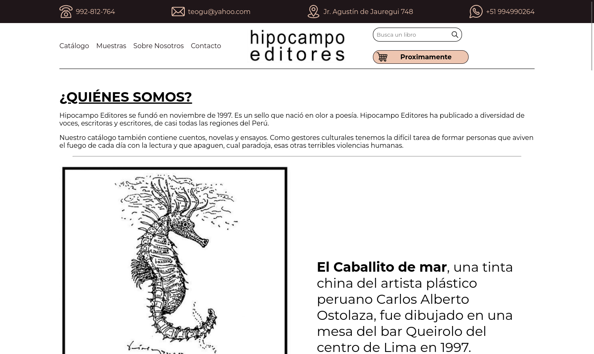
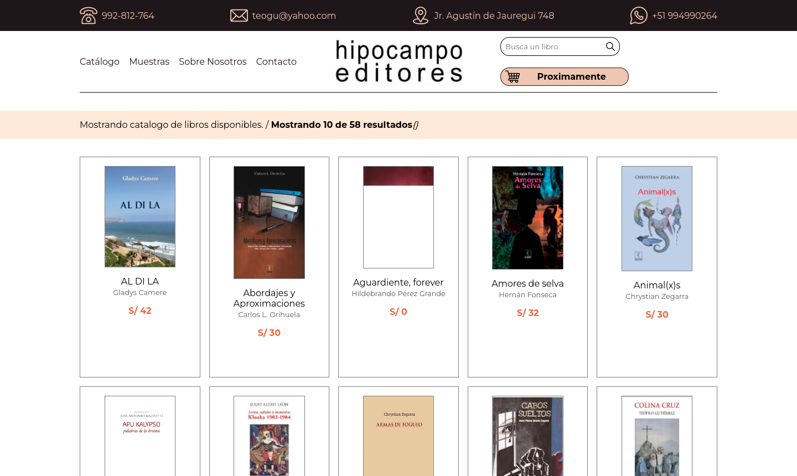
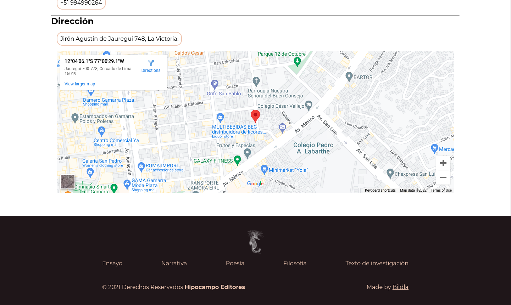

# Hipocampo Website

A website with `information pages` and a catalog of products for the Hipocampo Editores editorial.

## Table of Contents

- [Hipocampo Website](#hipocampo-website)
  - [Table of Contents](#table-of-contents)
  - [Objectives](#objectives)
  - [Technologies](#technologies)
  - [Screenshots](#screenshots)
  - [Installation](#installation)
  - [References](#references)

## Objectives

The website was required to have a custom design according to the brand identity, a catalog page with `dynamic rendering` of the products and their characteristics, and some information pages with the history and contact data of the brand, all this with a `responsive design` and implemented with an easy to update database.

## Technologies

Some of the technologies that were used to build this project.

- [Vue.js](https://vuejs.org/)
- [Firebase](https://firebase.google.com/?hl=es-419)
- [Sass](https://sass-lang.com/)

<div style="display:flex;justify-content:center;gap:16px">

  
  
  
</div>

## Screenshots

Some of the main views of the project.

- Mobile views

<div style="display:grid;grid-template-columns:1fr 1fr 1fr 1fr;gap:2rem">


</div>

- Desktop views

<div style="display:grid;grid-template-columns:1fr 1fr;gap:2rem">








</div>

## Installation

```bash
# bash
# Install the dependencies
$ npm install
# Start developtment server
$ npm run dev
# Build project and generate static files
$ npm run build
# View generated files
$ npm run serve
```

For more details, you can check [Vite docs](https://vitejs.dev/guide/build.html)

## References

The documentation sites and other resources that help with the project.

- [Firebase Docs](https://firebase.google.com/docs)
- [Coolors](https://coolors.co/)
